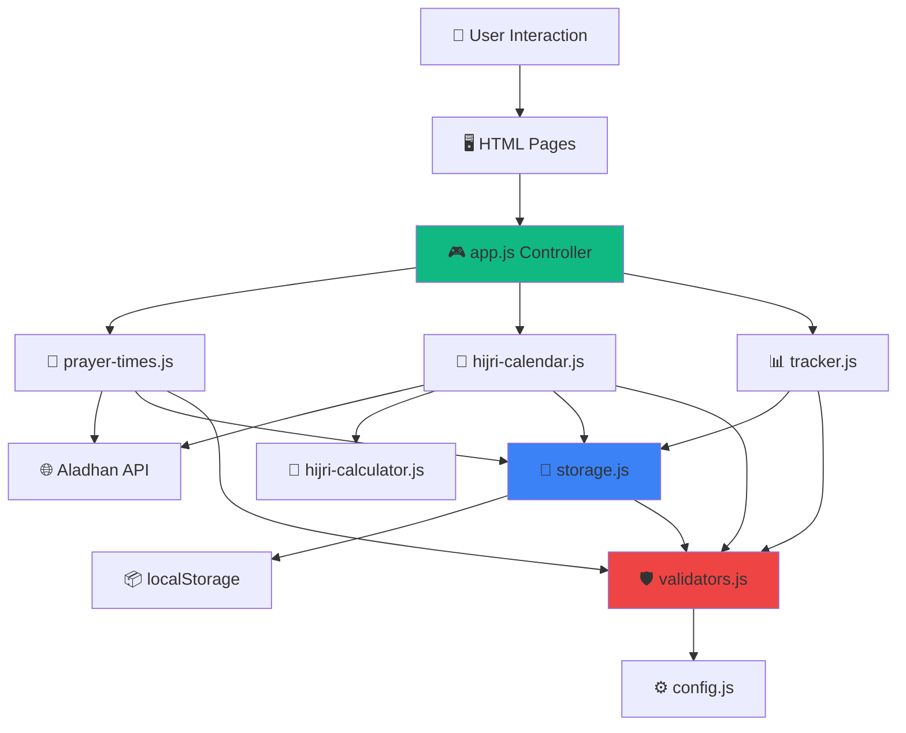

# 🌙 Aplikasi Web Puasa Ayyamul Bidh

> **Aplikasi web modern untuk melacak dan mengelola jadwal puasa Ayyamul Bidh** – puasa sunnah yang dijalankan setiap tanggal 13, 14, dan 15 dalam kalender Hijriyah. Dibangun dengan teknologi web standar (HTML5, CSS3, Vanilla JavaScript) tanpa framework kompleks, sehingga ringan, cepat, dan mudah dipelihara.

[]()
[]()
[]()
[]()
[]()

---

## ✨ Fitur-Fitur Unggulan

### 🏠 Dashboard Informasi Terintegrasi

Dashboard memberikan ringkasan lengkap semua informasi penting dalam satu tampilan:

- **📅 Tanggal Ganda**: Menampilkan tanggal Hijriyah dan Masehi hari ini secara real-time
- **⏰ Jam Digital**: Jam yang diperbarui setiap detik dengan deteksi zona waktu Indonesia otomatis (WIB/WITA/WIT)
- **⏳ Hitung Mundur Ayyamul Bidh**: Informasi berapa hari lagi menuju periode puasa Ayyamul Bidh berikutnya
- **🕌 Jadwal Shalat Hari Ini**: Ringkasan 6 waktu shalat dengan countdown ke shalat berikutnya
- **📊 Statistik Puasa**: 
  - Progress puasa bulan ini (dari target 3 hari)
  - Total puasa tahun ini (dari target 36 hari)
  - Streak: berapa bulan berturut-turut menyelesaikan puasa Ayyamul Bidh
- **🚀 Akses Cepat**: Tombol pintas untuk navigasi ke fitur-fitur utama

### 🕌 Jadwal Shalat Komprehensif

Fitur jadwal shalat yang lengkap dan akurat berdasarkan lokasi Anda:

- **7 Waktu Shalat**: Imsak, Subuh, Terbit (Syuruq), Dzuhur, Ashar, Maghrib, dan Isya
- **⏰ Jam Real-Time**: Ditampilkan dengan zona waktu yang terdeteksi otomatis
- **⏱️ Hitung Mundur**: Informasi "Akan tiba dalam X menit" untuk shalat berikutnya
- **✨ Penanda Visual**: Shalat yang sedang berlangsung diberi highlight khusus
- **📆 Tabel Jadwal Bulanan**: Jadwal lengkap untuk 30 hari ke depan dengan scroll horizontal
- **📍 Berbasis Lokasi**: Menggunakan koordinat GPS atau input manual kota untuk akurasi tinggi
- **⚙️ Metode Kalkulasi**: Mendukung 7 metode perhitungan, default menggunakan standar Kementerian Agama RI

### 📅 Kalender Hijriyah Interaktif

Kalender visual yang memudahkan pelacakan tanggal Hijriyah:

- **🔄 Konversi Tanggal**: Konversi dua arah antara kalender Masehi (Gregorian) dan Hijriyah
- **🎨 Tampilan Visual Menarik**: 
  - Grid kalender dengan highlight otomatis untuk tanggal Ayyamul Bidh (13, 14, 15)
  - Penanda hari yang sudah berpuasa (terintegrasi dengan tracker)
  - Indikator tanggal hari ini
- **🧭 Navigasi Mudah**: Tombol prev/next untuk berpindah bulan, plus tombol "Hari Ini"
- **📋 Jadwal 3 Bulan**: Menampilkan jadwal Ayyamul Bidh untuk 3 bulan ke depan
- **ℹ️ Info Detail**: Klik tanggal untuk melihat informasi lengkap

### 📊 Tracker Puasa yang Pintar

Sistem pencatatan puasa yang lengkap dengan analitik:

- **✅ Check/Uncheck Sederhana**: Tandai hari puasa hanya dengan satu klik
- **📈 Statistik Multi-Level**:
  - **Bulanan**: Progress dari target 3 hari per bulan (dengan persentase dan bar chart)
  - **Tahunan**: Progress dari target 36 hari per tahun (dengan persentase)
  - **Streak**: Tracking berapa bulan berturut-turut Anda menyelesaikan 3 hari puasa
- **📜 Riwayat Lengkap**: 
  - Accordion per bulan dengan status: Lengkap (3/3), Sebagian (1-2/3), atau Kosong
  - Filter dan sortir berdasarkan tanggal
- **💾 Backup & Restore**: 
  - Export data ke format JSON
  - Import data dari backup dengan validasi integrity
  - Backup otomatis sebelum import

### 📖 Panduan Islami Lengkap

Referensi keislaman yang bermanfaat:

- **📜 Dalil & Hadits**: Hadits shahih tentang keutamaan puasa Ayyamul Bidh dengan sanad
- **🤲 Doa-Doa Puasa**: 
  - Doa berbuka puasa (Arab + Latin + Terjemahan Indonesia)
  - Doa sahur (Arab + Latin + Terjemahan Indonesia)
  - Niat puasa sunnah
- **❓ FAQ (Tanya Jawab)**: Jawaban untuk 10+ pertanyaan umum seputar puasa Ayyamul Bidh
- **💡 Tips Praktis**: Panduan dan tips agar konsisten menjalankan puasa sunnah

### ⚙️ Pengaturan Fleksibel

Kustomisasi aplikasi sesuai kebutuhan Anda:

- **📍 Manajemen Lokasi**:
  - Auto-detect menggunakan GPS browser (dengan izin pengguna)
  - Input manual: Nama kota + Negara
  - Simpan preferensi lokasi
- **🕌 Metode Kalkulasi Shalat** (7 pilihan):
  - Kementerian Agama Republik Indonesia (Default) ⭐
  - Muslim World League (MWL)
  - Islamic Society of North America (ISNA)
  - Egyptian General Authority of Survey
  - Umm Al-Qura University, Mekkah
  - University of Islamic Sciences, Karachi
  - Institute of Geophysics, University of Tehran
- **💾 Manajemen Data**:
  - **Export**: Unduh semua data dalam format JSON
  - **Import**: Restore data dari file backup dengan validasi
  - **Reset**: Hapus semua data (dengan konfirmasi ganda untuk keamanan)
- **🔒 Privasi**: Semua data tersimpan di browser Anda (localStorage), tidak ada server eksternal

---

## 🚀 Cara Menggunakan

### 🌟 Untuk Pengguna Umum (Tanpa Pengetahuan Teknis)

**Cara paling mudah - Langsung buka di browser:**

1. **Download Aplikasi**:
   - Klik tombol hijau "Code" di halaman GitHub ini
   - Pilih "Download ZIP"
   - Extract file ZIP ke folder di komputer Anda

2. **Buka Aplikasi**:
   - Cari file `index.html` di folder hasil extract
   - Double-click file tersebut, atau
   - Klik kanan → "Open with" → Pilih browser favorit (Chrome/Firefox/Edge)

3. **Setup Awal** (hanya sekali):
   - Aplikasi akan meminta izin untuk mengakses lokasi GPS → Klik "Izinkan/Allow"
   - Jika tidak ingin menggunakan GPS, klik "Skip" dan atur lokasi manual di menu **Pengaturan**

4. **Siap Digunakan!** 🎉
   - Dashboard akan menampilkan semua informasi
   - Mulai tandai hari puasa Anda di menu **Tracker**
   - Lihat jadwal shalat di menu **Jadwal Shalat**
   - Cek kalender Hijriyah di menu **Kalender**

**💡 Tips untuk Pengguna:**
- 💾 **Backup Rutin**: Export data Anda secara berkala dari menu Pengaturan
- 🔖 **Bookmark**: Tambahkan ke bookmark browser untuk akses cepat
- 📍 **Update Lokasi**: Jika pindah kota, update lokasi di Pengaturan
- 🌙 **Cek Rutin**: Lihat countdown Ayyamul Bidh di dashboard setiap hari

---

### 👨‍💻 Untuk Developer

Aplikasi ini sangat mudah untuk di-develop karena tidak memerlukan build process yang kompleks.

**Opsi 1: Buka Langsung di Browser (Paling Sederhana)**

```bash
# Clone repository
git clone https://github.com/yourusername/puasa-ayyamul-bidh.git
cd puasa-ayyamul-bidh

# Buka index.html langsung di browser
# Atau gunakan extension "Live Server" di VS Code untuk auto-reload
```

**Opsi 2: Development Server dengan Vite (Direkomendasikan)**

```bash
# Install dependencies (hanya untuk dev tools)
npm install

# Jalankan development server
npm run dev
# Aplikasi akan berjalan di http://localhost:5173

# Build untuk production (optional)
npm run build
```

**Opsi 3: HTTP Server Alternatif**

```bash
# Menggunakan http-server
npm run serve
# Aplikasi akan berjalan di http://localhost:8000
```

**Setup Awal Development:**
1. Izinkan akses lokasi GPS atau set manual di menu Pengaturan
2. Pilih metode kalkulasi shalat (default: Kemenag RI sudah sesuai untuk Indonesia)
3. Buka DevTools untuk melihat console logs dan debugging
4. Mulai coding!

**📖 Dokumentasi Developer:**
Lihat folder `.agent/` untuk dokumentasi lengkap:
- `AI_AGENT_GUIDE.md` - Panduan lengkap untuk AI assistants
- `CODING_STANDARDS.md` - Style guide dan konvensi kode
- `SECURITY_GUIDELINES.md` - Best practices keamanan
- `PROJECT_OVERVIEW.md` - Arsitektur dan overview sistem

---

## 🏗️ Teknologi yang Digunakan

### Core Technologies

**Framework & Library Utama:**
- **HTML5** - Semantic markup dengan accessibility terbaik
- **CSS3** - Custom styling modern
- **Bootstrap 5.3.8** - Framework CSS untuk responsive design dan komponen UI
- **Vanilla JavaScript ES6+** - Modular JavaScript tanpa framework, menggunakan ES6 Modules
- **localStorage Web API** - Penyimpanan data lokal dengan validation layer

**External APIs:**
- **[Aladhan API](https://aladhan.com/prayer-times-api)** - Prayer times calculation & Hijri calendar conversion
- **Browser Geolocation API** - Deteksi lokasi pengguna otomatis

### Development Tools

**AI-Powered Development:**
- **[Google Antigravity Editor](https://www.google.com/antigravity)** - AI-powered code editor untuk development workflow 🤖
- **[Google Gemini 3.0 Pro](https://deepmind.google/technologies/gemini/)** - AI assistant untuk coding, refactoring, dan problem solving 🧠
- **[Anthropic Claude 4.5 Sonnet](https://www.anthropic.com/claude)** - AI assistant untuk code review, documentation, dan quality assurance 📝

**Build Tools (Dev Only):**
- **Vite 7.2.4** - Lightning-fast development server dengan Hot Module Replacement (HMR)
- **http-server 14.1.1** - Simple HTTP server alternatif
- **Terser 5.44.1** - JavaScript minifier untuk production build
- **npm** - Package manager

**Styling & Assets:**
- **Bootstrap Icons** - Icon library
- **Google Fonts** - Web fonts (Inter untuk Latin, Amiri untuk Arabic)

> **⚠️ Catatan Penting**: Aplikasi ini **tidak memerlukan build process untuk berjalan**. Semua JavaScript modules dimuat langsung oleh browser menggunakan ES6 import/export. Vite dan build tools hanya digunakan untuk development experience yang lebih baik (hot reload, dll).

---

## 📂 Struktur Project

```
puasa-ayyamul-bidh/
├── .agent/                      # 🤖 Dokumentasi AI Agent & Workflows
│   ├── rules/                   # Aturan dan guidelines untuk AI
│   ├── workflows/               # Workflow automasi
│   ├── AI_AGENT_GUIDE.md        # Panduan lengkap untuk AI assistants
│   ├── PROJECT_OVERVIEW.md      # Overview arsitektur sistem
│   ├── SECURITY_GUIDELINES.md   # Best practices keamanan
│   └── CODING_STANDARDS.md      # Standar dan konvensi kode
│
├── js/                          # 📦 JavaScript Modules (ES6)
│   ├── config.js                # ⚙️  Konfigurasi dan konstanta global
│   ├── validators.js            # 🛡️  Validasi dan sanitasi data (security layer)
│   ├── storage.js               # 💾  localStorage wrapper dengan auto-validation
│   ├── app.js                   # 🎮  Main application controller & lifecycle
│   ├── prayer-times.js          # 🕌  Integrasi Aladhan API untuk jadwal shalat
│   ├── hijri-calendar.js        # 📅  Logika kalender Hijriyah & konversi
│   ├── hijri-calculator.js      # 🧮  Kalkulasi Hijri lokal (progressive loading)
│   ├── tracker.js               # 📊  Tracker puasa dengan statistik
│   ├── utils.js                 # 🔧  Helper functions & utilities
│   ├── request-queue.js         # 🚦  Queue management untuk API requests
│   └── main.js                  # 🚪  Entry point aplikasi
│
├── css/                         # 🎨 Stylesheets
│   ├── style.css                # Main stylesheet
│   └── components.css           # Component-specific styles
│
├── assets/                      # 🖼️  Images & static files
│
├── plan/                        # 📋  Planning docs & implementation notes
│   ├── code-review-report.md    # Laporan security audit
│   ├── implementation-summary.md # Ringkasan implementasi
│   └── ... (dokumen planning lainnya)
│
├── dist/                        # 📦  Production build output (generated)
│
├── *.html                       # 📄  HTML Pages
│   ├── index.html               # Dashboard / Home page
│   ├── jadwal-shalat.html       # Prayer times page
│   ├── kalender.html            # Hijri calendar page
│   ├── tracker.html             # Fasting tracker page
│   ├── panduan.html             # Islamic guide page
│   └── pengaturan.html          # Settings page
│
├── package.json                 # 📦  npm configuration
├── vite.config.js               # ⚡  Vite configuration
└── README.md                    # 📖  Dokumentasi ini

```

### Penjelasan File Penting

| File | Ukuran | Deskripsi |
|------|--------|-----------|
| `js/app.js` | ~16 KB | Controller utama yang mengkoordinasikan semua modules |
| `js/validators.js` | ~11 KB | Security layer dengan validasi schema lengkap |
| `js/hijri-calendar.js` | ~13 KB | Logika kalender Hijriyah dengan progressive loading |
| `js/prayer-times.js` | ~11 KB | Integrasi API dengan caching & error handling |
| `js/utils.js` | ~10 KB | Helper functions untuk formatting, timezone, dll |
| `js/tracker.js` | ~10 KB | Manajemen data puasa dengan statistik |
| `js/storage.js` | ~6 KB | localStorage wrapper dengan validation otomatis |

---

## 🧩 Arsitektur Sistem

### Desain Modular

Aplikasi menggunakan **ES6 Modules** dengan prinsip **Separation of Concerns** dan **Single Responsibility**:

```javascript
// Dependency Flow (Hierarki Module)
main.js
  └─▶ app.js (Application Controller)
       ├─▶ config.js       (Global constants & configuration)
       ├─▶ validators.js   (Input validation & sanitization)
       ├─▶ storage.js      (localStorage dengan auto-validation)
       ├─▶ prayer-times.js (Aladhan API integration)
       ├─▶ hijri-calendar.js (Kalender Hijriyah logic)
       ├─▶ hijri-calculator.js (Local Hijri calculation)
       ├─▶ tracker.js      (Fasting data management)
       ├─▶ request-queue.js (API request queuing)
       └─▶ utils.js        (Helper utilities)
```

### Key Modules & Tanggung Jawabnya

| Module | Purpose | Key Features | Dependencies |
|--------|---------|--------------|--------------|
| **config.js** | Konfigurasi terpusat | Constants, API endpoints, validation rules | - |
| **validators.js** | Security layer | Schema validation, sanitization, prototype pollution prevention | config.js |
| **storage.js** | Data persistence | localStorage wrapper dengan auto-validation | validators.js, config.js |
| **app.js** | Application controller | Lifecycle management, koordinasi modules, event handling | Semua modules |
| **prayer-times.js** | Prayer times API | Aladhan API integration, caching, error handling | validators.js, storage.js, request-queue.js |
| **hijri-calendar.js** | Hijri calendar | Date conversion, Ayyamul Bidh calculation, progressive loading | hijri-calculator.js, prayer-times.js, validators.js |
| **hijri-calculator.js** | Local Hijri calc | Offline Hijri calculation untuk initial load | - |
| **tracker.js** | Fasting tracker | Data management, statistics, import/export | storage.js, validators.js |
| **utils.js** | Utilities | Date formatting, timezone detection, toast, helpers | config.js |
| **request-queue.js** | API queue | Rate limiting, request queuing untuk API calls | - |

### Data Flow Pattern



### Security Architecture

Aplikasi menerapkan **Defense in Depth** dengan multiple security layers:

1. **Input Layer** → `validators.js` - Validasi & sanitasi semua input
2. **Storage Layer** → `storage.js` - Auto-validation pada read/write localStorage
3. **API Layer** → `prayer-times.js` - Validasi response sebelum digunakan
4. **Presentation Layer** → Safe DOM manipulation (textContent, createElement)


---

## 🔒 Keamanan & Kualitas

### 🛡️ Skor Keamanan: **8.5/10**

Aplikasi ini dibangun dengan pendekatan **security-first** menggunakan multiple layers of protection:

#### Proteksi Keamanan yang Diterapkan

| Layer | Proteksi | Implementasi |
|-------|----------|-------------|
| **Input** | XSS Prevention | Sanitasi input via `Validators.sanitizeString()`, safe DOM manipulation |
| **Storage** | localStorage Injection Prevention | Auto-validation pada semua read/write operations |
| **API** | Response Validation | Schema validation untuk semua API responses |
| **Object** | Prototype Pollution Prevention | Deep cloning dengan filtering `__proto__`, `constructor`, dll |
| **Display** | Safe Rendering | Hanya gunakan `textContent`, `createElement` - NO `innerHTML` |

#### 📋 Hasil Security Audit (November 2025)

✅ **Semua critical vulnerabilities telah diperbaiki:**
- XSS (Cross-Site Scripting) 
- Prototype Pollution
- localStorage Injection
- Unvalidated API Data
- Debug Code Leakage

📄 **Detail lengkap**: Lihat `plan/code-review-report.md` dan `plan/implementation-summary.md`

---

## 🎨 Desain & UX

### Prinsip Desain

- **📱 Mobile-First**: Responsive dari smartphone hingga desktop
- **♿ Accessible**: Semantic HTML, ARIA labels, keyboard navigation support
- **⚡ Performance**: Caching optimal, minimal API calls, lazy loading
- **🎯 Clean & Simple**: Interface modern, minimalis dengan estetika Islami

### Palet Warna

| Fungsi | Warna | Hex Code |
|--------|-------|----------|
| Primary | Emerald Green | `#10b981` |
| Accent | Teal | `#14b8a6` |
| Background | Light Gray | `#f9fafb` |
| Text | Dark Gray | `#1f2937` |

### Tipografi

- **Latin**: Inter (Google Fonts) - modern sans-serif
- **Arabic**: Amiri (Google Fonts) - traditional Arabic font

---

## 📱 Penjelasan Detail Fitur

Berikut adalah penjelasan lengkap untuk setiap halaman dan fitur dalam aplikasi:

### 1. 🏠 Halaman Dashboard (Beranda)

**Informasi Real-Time:**
- Tanggal Hijriyah dan Masehi hari ini dengan auto-update
- Jam digital yang update setiap detik dengan zona waktu Indonesia (WIB/WITA/WIT)
- Countdown dinamis ke periode Ayyamul Bidh berikutnya

**Ringkasan Waktu Shalat:**
- Grid 6 waktu shalat hari ini (Subuh, Dzuhur, Ashar, Maghrib, Isya, Imsak)
- Countdown ke shalat berikutnya dengan format "Akan tiba dalam X menit"
- Highlight otomatis untuk shalat yang sedang berlangsung

**Statistik Puasa:**
- Progress bulan ini (contoh: 2/3 hari)
- Total puasa tahun ini (contoh: 24/36 hari)
- Streak: berapa bulan berturut-turut menyelesaikan 3 hari puasa

**Akses Cepat:**
- Tombol navigasi ke semua halaman utama

### 2. 🕌 Halaman Jadwal Shalat

**Display Waktu:**
- Jam digital real-time (HH:MM:SS) dengan zona waktu otomatis
- 7 waktu shalat lengkap: Imsak, Subuh, Terbit, Dzuhur, Ashar, Maghrib, Isya
- Countdown real-time ke shalat berikutnya

**Jadwal Bulanan:**
- Tabel jadwal lengkap untuk 30 hari ke depan
- Scroll horizontal untuk kemudahan navigasi

**Akurasi:**
- Berbasis koordinat GPS atau input manual kota
- Mendukung 7 metode kalkulasi internasional

### 3. 📅 Halaman Kalender Hijriyah

**Konversi Tanggal:**
- Gregorian (Masehi) → Hijri (Komariyah)
- Hijri (Komariyah) → Gregorian (Masehi)

**Tampilan Kalender:**
- Grid visual dengan highlight tanggal Ayyamul Bidh (13, 14, 15)
- Integrasi dengan tracker - menampilkan tanggal yang sudah berpuasa
- Penanda hari ini

**Navigasi:**
- Tombol Prev/Next untuk berpindah bulan
- Tombol "Hari Ini" untuk kembali ke bulan sekarang
- Jadwal 3 bulan ke depan untuk Ayyamul Bidh

### 4. 📊 Halaman Tracker Puasa

**Pencatatan:**
- Checkbox untuk mark/unmark hari puasa
- Interface sederhana dan intuitif

**Analitik:**
- **Bulanan**: Progress dari target 3 hari (dengan bar chart)
- **Tahunan**: Progress dari target 36 hari (dengan persentase)
- **Streak**: Tracking konsistensi (berapa bulan berturut-turut lengkap)

**Riwayat:**
- Accordion per bulan dengan status: Lengkap (3/3), Sebagian (1-2/3), Kosong
- Filter dan sorting berdasarkan tanggal

**Backup & Restore:**
- Export: Download data ke file JSON
- Import: Upload file backup dengan validasi integrity
- Backup otomatis sebelum import untuk keamanan

### 5. 📖 Halaman Panduan Islami

**Dalil & Hadits:**
- Hadits shahih tentang keutamaan puasa Ayyamul Bidh
- Sanad dan penjelasan konteks

**Doa-Doa:**
- Doa berbuka puasa (Arab, Latin, Terjemahan Indonesia)
- Doa sahur (Arab, Latin, Terjemahan Indonesia)
- Niat puasa sunnah

**Tanya Jawab (FAQ):**
- 10+ pertanyaan umum dan jawabannya
- Hukum, tata cara, dan tips praktis

### 6. ⚙️ Halaman Pengaturan

**Manajemen Lokasi:**
- Auto-detect menggunakan GPS browser (dengan izin pengguna)
- Input manual: Nama Kota + Negara
- Simpan preferensi untuk penggunaan berikutnya

**Metode Kalkulasi Shalat:**
1. Kementerian Agama RI (Default - Indonesia) ⭐
2. Muslim World League (MWL)
3. Islamic Society of North America (ISNA)
4. Egyptian General Authority of Survey
5. Umm Al-Qura University, Mekkah
6. University of Islamic Sciences, Karachi
7. Institute of Geophysics, University of Tehran

**Manajemen Data:**
- **Export**: Unduh semua data dalam format JSON
- **Import**: Restore dari file backup dengan validasi
- **Reset**: Hapus semua data (konfirmasi ganda untuk mencegah kesalahan)

**Privasi:**
- Semua data tersimpan lokal di browser Anda (localStorage)
- Tidak ada pengiriman data ke server eksternal
- Data hanya bisa diakses oleh Anda

---

## 🌐 Dukungan Browser

| Browser | Versi Minimum | Status |
|---------|---------------|--------|
| Chrome / Edge | Terbaru | ✅ Didukung penuh |
| Firefox | Terbaru | ✅ Didukung penuh |
| Safari | Terbaru | ✅ Didukung penuh |
| Opera | Terbaru | ✅ Didukung penuh |
| Mobile Safari | iOS 12+ | ✅ Didukung |
| Chrome Mobile | Android 5+ | ✅ Didukung |

> **⚠️ Catatan Penting**: Fitur Geolocation (GPS) memerlukan koneksi HTTPS atau localhost untuk alasan keamanan.

---

## 👨‍💻 Panduan Development

### Setup Cepat

```bash
# 1. Clone repository
git clone https://github.com/yourusername/puasa-ayyamul-bidh.git
cd puasa-ayyamul-bidh

# 2. Install dev dependencies
npm install

# 3. Jalankan development server
npm run dev
# Atau gunakan alternatif:
npm run serve
```

### Coding Guidelines

**Dokumentasi lengkap** tersedia di folder `.agent/`:

- `AI_AGENT_GUIDE.md` - Panduan comprehensive untuk AI assistants
- `CODING_STANDARDS.md` - Style guide dan konvensi kode
- `SECURITY_GUIDELINES.md` - Security patterns dan best practices
- `PROJECT_OVERVIEW.md` - Arsitektur sistem

**Rules Penting (Quick Reference):**

✅ **DO:**
- Gunakan konstanta dari `Config` (hindari magic numbers)
- Validasi **semua** data eksternal (API, localStorage, user input)
- Sanitasi input user sebelum digunakan
- Gunakan `Storage` module, **bukan** direct `localStorage`
- Tambahkan JSDoc comments untuk fungsi public
- Handle errors dengan proper error messages

❌ **DON'T:**
- Jangan gunakan `innerHTML` dengan dynamic data
- Jangan simpan data sensitif ke localStorage
- Jangan skip validation, meskipun data dari trusted source

### Testing

**Manual Testing:**
```bash
npm run dev
# Buka browser, test semua fitur
```

**Security Testing:**
- Test XSS: Coba inject `<script>alert('XSS')</script>` pada input
- Test localStorage: Edit manual via DevTools, pastikan validation bekerja
- Test API: Simulasikan invalid responses

**Roadmap**: Unit tests dengan Jest, E2E tests dengan Playwright

---

---

## 📝 Referensi API

### Aladhan API Endpoints

Aplikasi menggunakan endpoints berikut dari [Aladhan API](https://aladhan.com/prayer-times-api):

```http
# Waktu shalat berdasarkan kota
GET /v1/timingsByCity/{date}
    ?city={city}
    &country={country}
    &method={method}

# Waktu shalat berdasarkan koordinat GPS
GET /v1/timings/{date}
    ?latitude={lat}
    &longitude={lon}
    &method={method}

# Konversi tanggal: Gregorian → Hijri
GET /v1/gToH/{date}

# Konversi tanggal: Hijri → Gregorian
GET /v1/hToG/{date}

# Kalender bulanan
GET /v1/calendarByCity/{year}/{month}
    ?city={city}
    &country={country}
```

**Parameter `method` (Metode Kalkulasi):**
- `20` = Kementerian Agama RI (Default)
- `3` = Muslim World League (MWL)
- `2` = Islamic Society of North America (ISNA)
- `5` = Egyptian General Authority
- `4` = Umm Al-Qura University
- `1` = University of Islamic Sciences, Karachi
- `7` = Institute of Geophysics, Tehran

> **Note**: Aplikasi mengimplementasikan caching untuk mengurangi API calls dan meningkatkan performa.

---

---

## 🐛 Known Issues & Future Improvements

### ✅ Completed Features
- ✅ Kalender Hijriyah interaktif dengan progressive loading
- ✅ Tracker puasa dengan visualisasi chart dan statistik lengkap
- ✅ Real-time clock dengan timezone auto-detection
- ✅ Responsive menu untuk desktop dan mobile
- ✅ Lokalisasi 100% Bahasa Indonesia

### 🚧 Planned Features (Roadmap)
- [ ] **Browser Notifications** - Notifikasi untuk mengingatkan jadwal shalat
- [ ] **PWA Support** - Progressive Web App untuk install di home screen
- [ ] **Dark Mode** - Tema gelap untuk kenyamanan mata
- [ ] **Multi-language** - Dukungan bahasa Inggris dan Arab
- [ ] **Automated Tests** - Unit tests, integration tests, E2E tests

📋 **Lihat lebih lengkap**: [GitHub Issues](https://github.com/yourusername/puasa-ayyamul-bidh/issues)

---

## 🆕 Update Terkini

### Versi 1.0.0 (Desember 2025)

**🎉 Fitur-Fitur Utama yang Telah Diimplementasikan:**

1. **⏰ Jam Real-Time & Zona Waktu**
   - Jam digital (HH:MM:SS) yang update setiap detik
   - Auto-detection zona waktu Indonesia (WIB/WITA/WIT)
   - Countdown "Akan tiba dalam X menit" untuk shalat berikutnya

2. **📅 Kalender Hijriyah Interaktif**
   - Grid kalender visual dengan highlight Ayyamul Bidh
   - Progressive loading (load lokal dulu, kemudian upgrade dengan API)
   - Integrasi dengan tracker puasa
   - Jadwal 3 bulan ke depan

3. **📊 Tracker Puasa Lengkap**
   - Checkbox interface yang simple
   - Statistik bulanan, tahunan, dan streak
   - Visual bar chart untuk progress
   - History accordion dengan status lengkap
   - Export/Import dengan validasi

4. **🕌 Jadwal Shalat Komprehensif**
   - 7 waktu shalat (Imsak, Subuh, Terbit, Dzuhur, Ashar, Maghrib, Isya)
   - Tabel jadwal bulanan 30 hari
   - Location-based dengan GPS atau manual

5. **🇮🇩 Lokalisasi Penuh**
   - 100% Bahasa Indonesia di seluruh UI
   - Tidak ada lagi teks Inggris yang tersisa

6. **📱 Responsivitas**
   - Mobile-first design
   - Hamburger menu yang mudah diakses
   - Layout optimal untuk semua ukuran layar

7. **🛡️ Keamanan**
   - XSS prevention dengan input sanitization
   - Prototype pollution protection
   - localStorage validation
   - API response validation

**🐛 Bug Fixes:**
- ✅ Parse error waktu shalat dengan format "04:32 (WIB)"
- ✅ `process.env` error diganti dengan `import.meta.env`
- ✅ Footer credit updated ke "Gulajava Ministudio"

**📄 Detail lengkap**: Lihat `plan/implementation-summary.md`

---

---

## 🗺️ Roadmap Pengembangan

### v1.1 - Peningkatan UX (Q1 2026)
- [ ] **Browser Notifications** - Notifikasi push untuk waktu shalat
- [ ] **Dark Mode** - Toggle tema gelap untuk kenyamanan mata
- [ ] **Offline Mode Enhancement** - Service Worker untuk pengalaman offline lebih baik
- [ ] **Performance Optimization** - Code splitting dan lazy loading

### v2.0 - Ekspansi Fitur (Q2 2026)
- [ ] **PWA Full Support** - Install ke home screen, fully offline-capable
- [ ] **Multi-language** - Interface dalam Bahasa Inggris dan Arab
- [ ] **Social Sharing** - Share progress puasa ke social media
- [ ] **Reminders & Alerts** - Customizable reminders untuk puasa
- [ ] **Automated Testing** - Unit tests, integration tests, E2E tests

### v3.0 - Ekosistem (Future)
- [ ] **Mobile Apps** - Native apps dengan React Native / Flutter
- [ ] **Backend Sync** - Optional cloud backup dan sync antar device
- [ ] **Community Features** - Leaderboard, challenges, dan group fasting tracker
- [ ] **Widget Support** - Desktop dan mobile widgets

**💡 Have ideas?** Submit feature requests di [GitHub Issues](https://github.com/yourusername/puasa-ayyamul-bidh/issues)

---

## 🤝 Kontribusi

Kami sangat menghargai kontribusi dari komunitas! Berikut cara berkontribusi:

### Langkah-langkah Kontribusi

1. **Fork** repository ini
2. **Clone** fork Anda ke lokal:
   ```bash
   git clone https://github.com/YOUR_USERNAME/puasa-ayyamul-bidh.git
   ```
3. **Create branch** untuk fitur Anda:
   ```bash
   git checkout -b feature/FiturAmazingAnda
   ```
4. **Baca dokumentasi** di `.agent/` folder:
   - `CODING_STANDARDS.md` - Panduan style code
   - `SECURITY_GUIDELINES.md` - Panduan keamanan
5. **Develop & Test** - Kembangkan fitur dan test secara menyeluruh
6. **Commit** dengan pesan yang jelas:
   ```bash
   git commit -m "feat: menambahkan fitur amazing"
   ```
7. **Push** ke branch Anda:
   ```bash
   git push origin feature/FiturAmazingAnda
   ```
8. **Open Pull Request** dengan deskripsi lengkap

### Checklist Sebelum Pull Request

- [ ] Code mengikuti coding standards
- [ ] Security review passed (tidak ada vulnerability)
- [ ] Manual testing berhasil di berbagai browser
- [ ] Tidak ada `console.log` atau debug code
- [ ] Dokumentasi diupdate jika menambah fitur baru
- [ ] Commit messages jelas dan deskriptif

**Types of Contributions:**
- 🐛 Bug fixes
- ✨ New features
- 📚 Documentation improvements
- 🎨 UI/UX enhancements
- 🔒 Security improvements
- ♿ Accessibility improvements

---

## 📄 Lisensi

Aplikasi ini bersifat **open source** dan gratis untuk digunakan.

**MIT License** - Anda bebas untuk:
- ✅ Menggunakan untuk project pribadi atau komersial
- ✅ Memodifikasi sesuai kebutuhan
- ✅ Mendistribusikan ke orang lain
- ✅ Menggunakan sebagai bahan pembelajaran

**Dengan syarat:**
- 📝 Tetap cantumkan credit ke project original
- 📝 Sertakan copy dari MIT License

Dibuat dengan ❤️ untuk kepentingan umum umat Muslim di seluruh dunia.

---

## 🙏 Credits & Terima Kasih

### APIs & External Services

- **[Aladhan API](https://aladhan.com)** - Penyedia data waktu shalat dan konversi kalender Hijriyah
- **[Browser Geolocation API](https://developer.mozilla.org/en-US/docs/Web/API/Geolocation_API)** - Deteksi lokasi otomatis

### Libraries & Frameworks

- **[Bootstrap 5.3.8](https://getbootstrap.com)** - Framework CSS untuk responsive design
- **[Bootstrap Icons](https://icons.getbootstrap.com)** - Icon library
- **[Google Fonts](https://fonts.google.com)** - Web fonts (Inter untuk Latin, Amiri untuk Arabic)

### Development Tools

- **[Vite](https://vitejs.dev)** - Lightning-fast development server
- **[http-server](https://github.com/http-party/http-server)** - Simple HTTP server
- **[Terser](https://terser.org/)** - JavaScript minifier

### AI-Powered Development Partner

Development aplikasi ini dipercepat dengan bantuan AI assistants:

- **[Google Antigravity Editor](https://www.google.com/antigravity)** 🚀 - AI-powered IDE untuk workflow yang lebih produktif
- **[Google Gemini 3.0 Pro](https://deepmind.google/technologies/gemini/)** 🤖 - AI coding assistant untuk development dan refactoring
- **[Anthropic Claude 3.5 Sonnet](https://www.anthropic.com/claude)** 📚 - AI assistant untuk code review dan documentation

### Inspirasi & Dukungan

- Komunitas Muslim di seluruh dunia yang menjalankan puasa sunnah
- Sistem kalender Hijriyah (Komariyah) dan Masehi (Syamsiyah)
- Kebutuhan umat untuk tools yang memudahkan ibadah

**Developed by: [Gulajava Ministudio](https://github.com/yourusername)** 👨‍💻

---

## 📞 Kontak & Dukungan

Butuh bantuan atau ingin memberikan feedback? Hubungi kami melalui:

- 🐛 **Report Bugs**: [GitHub Issues](https://github.com/yourusername/puasa-ayyamul-bidh/issues)
- 💬 **Diskusi & Ide**: [GitHub Discussions](https://github.com/yourusername/puasa-ayyamul-bidh/discussions)
- 📧 **Email**: [your.email@example.com](mailto:your.email@example.com)
- 📱 **Website**: [puasa-ayyamul-bidh.vercel.app](https://puasa-ayyamul-bidh.vercel.app) (if deployed)

---

## 📊 Statistik Project

| Metric | Value |
|--------|-------|
| **Dibuat** | 2025 |
| **Terakhir Update** | Desember 2025 |
| **Versi** | 1.0.0 |
| **Security Score** | 8.5/10 🛡️ |
| **Code Quality** | 7.0/10 ⭐ |
| **Bahasa UI** | 100% Bahasa Indonesia 🇮🇩 |
| **Total Code** | ~3,500+ baris |
| **JavaScript Modules** | 11 files |
| **HTML Pages** | 6 halaman |
| **CSS Files** | 2 files |
| **Total File Size** | ~90 KB (uncompressed) |

---

## 💡 Tips & Best Practices

### Untuk Pengguna

| Tip | Deskripsi |
|-----|-----------|
| 💾 **Backup Rutin** | Export data setiap bulan untuk keamanan |
| 📍 **Update Lokasi** | Perbarui jika pindah kota agar jadwal shalat akurat |
| 🔖 **Bookmark** | Simpan ke bookmark browser untuk akses cepat |
| 📱 **Install PWA** | (Coming soon) Install sebagai app untuk pengalaman native |
| ✅ **Konsisten** | Tandai puasa segera setelah selesai agar tidak lupa |

### Untuk Developer

| Tip | Deskripsi |
|-----|-----------|
| 📖 **Baca Docs** | Mulai dengan `.agent/AI_AGENT_GUIDE.md` |
| 🛡️ **Security First** | Validasi SEMUA data eksternal tanpa exception |
| ⚙️ **Use Constants** | Gunakan `Config`, hindari magic numbers |
| 🧪 **Test Manually** | Jangan skip manual testing, esp. untuk security |
| 📝 **JSDoc** | Dokumentasikan public functions dengan JSDoc |
| 🔍 **Code Review** | Review security guidelines sebelum commit |

---

## 🌟 Star History

Jika project ini bermanfaat untuk Anda, tolong berikan ⭐ **Star** di GitHub untuk mendukung pengembangan lebih lanjut!

[](https://star-history.com/#yourusername/puasa-ayyamul-bidh&Date)

---

<div align="center">

**Dibuat dengan ❤️ untuk Umat Muslim di Seluruh Dunia**

Semoga aplikasi ini bermanfaat dan menjadi **amal jariyah** bagi kita semua! 🤲

**Barakallahu fiikum!** ✨

---

*Terakhir diupdate: Desember 2025 | Security Audit: November 2025 ✅ | UI: 100% Bahasa Indonesia 🇮🇩*

</div>
